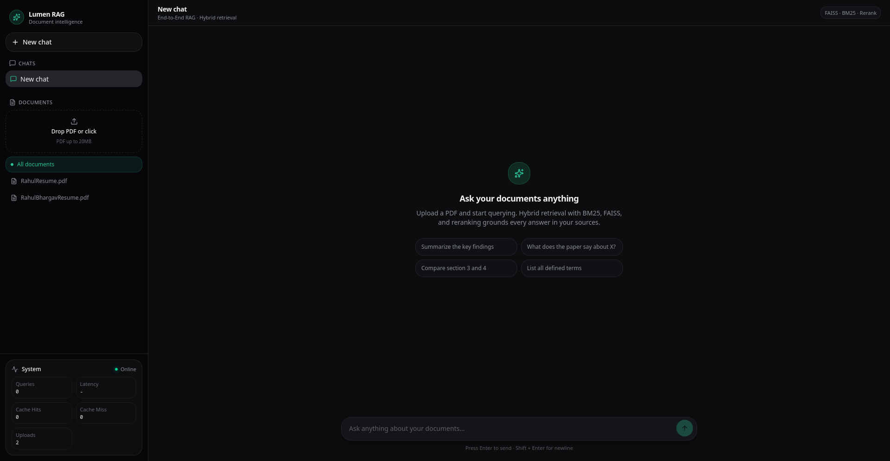

# Document Intelligence System — Production-Grade RAG AI Platform

<div align="center">


</div>

---

#  Hero Description

A production-style **Retrieval-Augmented Generation (RAG)** platform designed for intelligent document interaction at scale.

This system enables users to upload PDF documents, perform semantic + lexical hybrid retrieval, interact through multi-chat conversations, and receive grounded AI-generated responses powered by advanced retrieval engineering techniques.

Built with a strong focus on:

- scalable ML systems engineering
- production-ready backend architecture
- retrieval optimization
- monitoring & observability
- containerized deployment
- modern frontend experience

---

#  Demo / Screenshots


<!-- 
/screenshots
   ├── dashboard.png
   ├── upload-flow.png
   ├── chat-interface.png
   ├── monitoring.png -->


<!-- Example: -->

<!-- ```md -->


<!-- ``` -->
<!--  -->

---

#  Features

## Core AI Features

- **Hybrid Retrieval Pipeline** (FAISS + BM25)
- **Cross-Encoder Reranking**
- **Query Rewriting & Optimization**
- **PDF Upload & Intelligent Parsing**
- **Multi-Chat Interface**
- **Low-Latency Semantic Search**
- **Context-Aware Response Generation**
- **Source-Grounded AI Answers**

## Engineering & Infrastructure

-  **Monitoring Dashboard**
-  **Metrics Collection & Analytics**
-  **Dockerized Infrastructure**
-  **Production-Ready Configurations**
-  **LocalStorage Persistence**
-  **Container-Oriented Deployment**
-  **Modular Backend Architecture**

---

#  System Architecture

```text
                    ┌─────────────────────┐
                    │     React Frontend  │
                    │  Chat + Dashboard   │
                    └─────────┬───────────┘
                              │
                              ▼
                    ┌─────────────────────┐
                    │    FastAPI Backend  │
                    │  API + Orchestration│
                    └─────────┬───────────┘
                              │
         ┌────────────────────┼────────────────────┐
         ▼                    ▼                    ▼
┌────────────────┐  ┌────────────────┐  ┌────────────────┐
│ FAISS Vector DB│  │ BM25 Retriever │  │ Metrics Engine │
│ Semantic Search│  │ Lexical Search │  │ Monitoring     │
└────────┬───────┘  └────────┬───────┘  └────────────────┘
         │                   │
         └─────────┬─────────┘
                   ▼
        ┌────────────────────────┐
        │ Hybrid Retrieval Layer │
        └──────────┬─────────────┘
                   ▼
        ┌────────────────────────┐
        │ Cross-Encoder Reranker │
        └──────────┬─────────────┘
                   ▼
        ┌────────────────────────┐
        │ Context Builder        │
        └──────────┬─────────────┘
                   ▼
        ┌────────────────────────┐
        │ LLM Response Generator │
        └────────────────────────┘
```

---

# 🔎 Retrieval Pipeline

The platform implements a multi-stage retrieval architecture optimized for relevance, accuracy, and latency.

## 1. PDF Upload & Parsing

- Users upload PDF documents
- Text is extracted and normalized
- Metadata is generated for retrieval tracking

## 2. Intelligent Chunking

Documents are split into semantically meaningful chunks to improve retrieval granularity and context quality.

## 3. Embedding Generation

SentenceTransformer models generate dense vector embeddings for semantic similarity search.

## 4. FAISS Vector Storage

Embeddings are indexed using FAISS for high-performance nearest-neighbor retrieval.

## 5. BM25 Lexical Indexing

Traditional keyword-based retrieval improves precision for exact-match and sparse queries.

## 6. Hybrid Retrieval

Results from FAISS and BM25 are combined to maximize retrieval quality.

## 7. Cross-Encoder Reranking

A transformer-based reranker refines retrieved candidates based on contextual relevance.

## 8. Context Construction

Top-ranked chunks are assembled into optimized prompts for the LLM.

## 9. Response Generation

The LLM generates grounded, context-aware answers with improved factual consistency.

---

# 🛠️ Tech Stack

## Backend

| Technology | Purpose |
|---|---|
| FastAPI | API framework |
| Python | Core backend language |
| SentenceTransformers | Embedding generation |
| FAISS | Vector similarity search |
| BM25 | Lexical retrieval |
| OpenAI / OpenRouter SDK | LLM inference |
| Gunicorn | Production WSGI server |
| Docker | Containerization |

## Frontend

| Technology | Purpose |
|---|---|
| React | Frontend framework |
| Tailwind CSS v4 | UI styling |
| Axios | API communication |
| LocalStorage | Client persistence |

## Infrastructure

| Technology | Purpose |
|---|---|
| Docker | Container runtime |
| Docker Compose | Multi-service orchestration |

---

#  Folder Structure

```bash
document-intelligence-system/
│
├── frontend/                         # React frontend application
│
├── backend/
│   ├── app/
│   │   ├── api/                     # API route handlers
│   │   │   ├── documents.py
│   │   │   ├── query.py
│   │   │   └── upload.py
│   │   │
│   │   ├── core/                    # Application configuration
│   │   │   └── config.py
│   │   │
│   │   ├── services/                # Core business logic & ML services
│   │   │   ├── bm25_service.py
│   │   │   ├── cache_service.py
│   │   │   ├── chunk_service.py
│   │   │   ├── document_service.py
│   │   │   ├── embedding_service.py
│   │   │   ├── llm_service.py
│   │   │   ├── logging_service.py
│   │   │   ├── pdf_service.py
│   │   │   ├── reranker_service.py
│   │   │   ├── retrival_service.py
│   │   │   ├── rewrite_query_service.py
│   │   │   └── vector_store.py
│   │   │
│   │   └── utils/                   # Utility/helper functions
│   │
│   ├── scripts/
│   │   └── download_nltk.py
│   │
│   ├── storage/                     # Persistent vector & document storage
│   │   ├── chunks.json
│   │   ├── documents.json
│   │   └── faiss_index.bin
│   │
│   ├── uploads/                     # Uploaded PDF documents
│   │
│   ├── main.py                      # FastAPI application entry point
│   ├── requirements.txt
│   ├── Dockerfile
│   └── query_logs.jsonl
│
├── docker-compose.yml
├── README.md
│
└── .gitignore
```


# ⚙️ Installation & Setup

## Clone Repository

```bash
git clone https://github.com/RahulBhargavR2/Document-Intelligence-System

cd Document-Intelligence-System
```

---

## Backend Setup

```bash
cd backend

python -m venv venv

source venv/bin/activate
# Windows:
# venv\Scripts\activate

pip install -r requirements.txt
```

### Environment Variables

Create a `.env.development` file:

```env
OPENAI_API_KEY=your_api_key
OPENROUTER_API_KEY=your_api_key

MODEL_NAME=gpt-4o-mini


ENVIRONMENT=development
```

### Run Backend

```bash
uvicorn main:app --reload
```

Backend runs on:

```bash
http://localhost:8000
```

---

## Frontend Setup

```bash
cd frontend

npm install
```

### Run Frontend

```bash
npm run dev
```

Frontend runs on:

```bash
http://localhost:5173
```

---

#  Docker Setup

The project supports fully containerized deployment using Docker Compose.

## Multi-Container Architecture

- Frontend Container → React Application
- Backend Container → FastAPI + Retrieval Pipeline
- Shared Networking → Internal API communication

## Build & Run

```bash
docker compose up --build
```

## Run in Detached Mode

```bash
docker compose up -d
```

## Stop Containers

```bash
docker compose down
```

---

#  API Endpoints

| Endpoint | Method | Description |
|---|---|---|
| `/upload` | POST | Upload PDF documents |
| `/query` | POST | Query documents using RAG pipeline |
| `/documents` | GET | Retrieve uploaded documents |
| `/metrics` | GET | Fetch monitoring metrics |
| `/health` | GET | Health check endpoint |

---

#  Monitoring & Metrics

The platform includes built-in observability and retrieval analytics.

## Metrics Tracked

- Query Latency
- Document Upload Statistics
- Retrieval Performance
- Reranking Efficiency
- Cache Hit Rate
- Query Analytics
- System Health Monitoring

## Monitoring Goals

- detect slow retrieval stages
- analyze query performance
- optimize retrieval quality
- monitor production readiness

---

#  Future Improvements

- PostgreSQL persistence layer
- User authentication & RBAC
- Streaming LLM responses
- Kubernetes deployment
- Async ingestion queue
- Cloud vector databases
- Distributed retrieval services
- Advanced caching layer
- Multi-tenant architecture
- CI/CD automation pipelines

---

#  Resume-Level Highlights

- Engineered a production-style Retrieval-Augmented Generation (RAG) platform using FastAPI, React, FAISS, and transformer-based retrieval pipelines.
- Implemented hybrid retrieval architecture combining semantic vector search and BM25 lexical ranking for improved retrieval quality.
- Integrated cross-encoder reranking and query rewriting pipelines to optimize contextual relevance and answer grounding.
- Designed modular backend infrastructure with Dockerized deployment, monitoring systems, and scalable API architecture.
- Built a modern multi-chat frontend with persistent session handling, metrics visualization, and responsive UI workflows.

---

# Deployment

The system is designed for cloud-ready deployment.

## Supported Deployment Options

| Platform | Purpose |
|---|---|
| Docker Compose | Local orchestration |
| Vercel | Frontend deployment |
| Render | Backend deployment |
| Cloud VM / VPS | Full-stack hosting |

## Deployment Readiness

- Containerized services
- Environment-based configuration
- Production Gunicorn setup
- Modular architecture
- Scalable retrieval pipeline

---

#  Learning Outcomes

This project demonstrates practical engineering concepts across modern AI systems:

- Retrieval-Augmented Generation (RAG)
- Hybrid Retrieval Systems
- Vector Databases & Semantic Search
- Cross-Encoder Reranking
- Production FastAPI Architecture
- Docker & Container Orchestration
- Monitoring & Observability
- Frontend/Backend Integration
- AI Infrastructure Design
- Scalable ML Systems Engineering

---

#  Author

## Rahul Bhargav R

- GitHub: https://github.com/RahulBhargavR2
- LinkedIn: https://www.linkedin.com/in/rahul-bhargav-r/
- Email: rahulbhargavrgk@gmail.com

---

<div align="center">

###  If you found this project interesting, consider starring the repository.

Built with scalable AI engineering principles and production-focused system design.

</div>